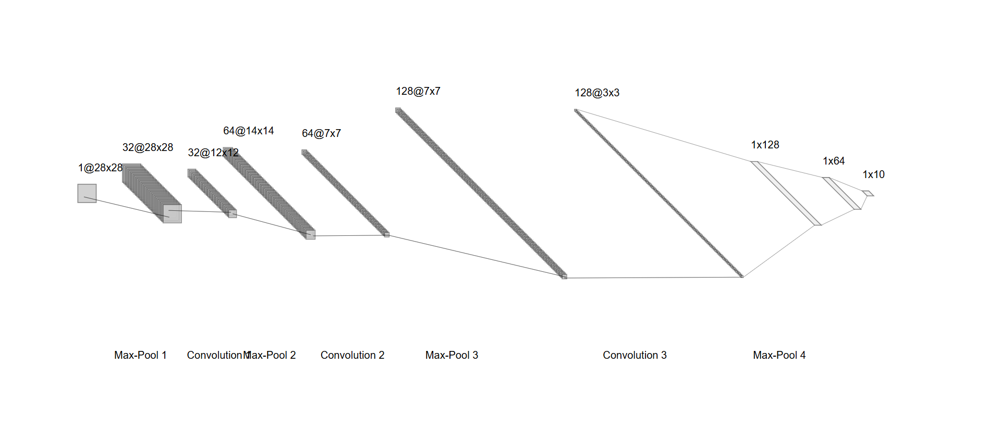
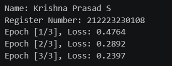
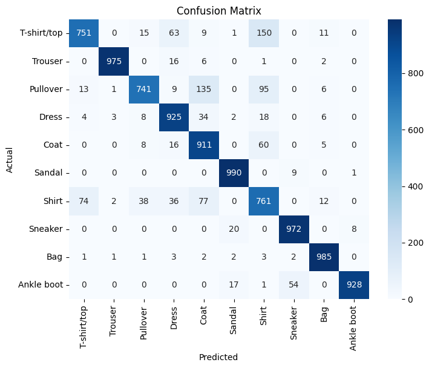
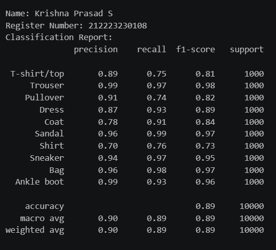
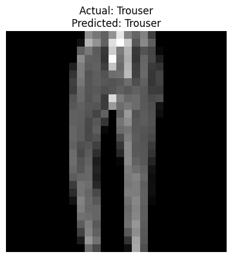

# Develop a Convolutional Deep Neural Network for Image Classification

## AIM
To develop a convolutional deep neural network (CNN) for image classification and to verify the response for new images.

##   PROBLEM STATEMENT AND DATASET
Image classification is a fundamental task in computer vision where an input image is assigned to one of several predefined classes. The objective of this experiment is to build and train a Convolutional Neural Network (CNN) using a labeled image dataset and evaluate its performance using accuracy, confusion matrix, and classification report.

## Neural Network Model


## DESIGN STEPS
### STEP 1: 
Load Fashion-MNIST dataset

### STEP 2: 
Initialize model


### STEP 3: 
Train the Model


### STEP 4: 
Test the Model


### STEP 5: 
Evaluate the model


### STEP 6: 
Predict on a Single Image


## PROGRAM

### Name: Krishna Prasad S

### Register Number: 212223230108

```python
class CNNClassifier(nn.Module):
    def __init__(self):
        super(CNNClassifier, self).__init__()
        super(CNNClassifier, self).__init__()
        self.conv1 = nn.Conv2d(1, 32, kernel_size=3, stride=1, padding=1)
        self.conv2 = nn.Conv2d(32, 64, kernel_size=3, stride=1, padding=1)
        self.conv3 = nn.Conv2d(64, 128, kernel_size=3, stride=1, padding=1)
        self.pool = nn.MaxPool2d(kernel_size=2, stride=2)
        self.fc1 = nn.Linear(128 * 3 * 3, 128)
        self.fc2 = nn.Linear(128, 64)
        self.fc3 = nn.Linear(64, 10)

    def forward(self, x):
        x = self.pool(torch.relu(self.conv1(x)))
        x = self.pool(torch.relu(self.conv2(x)))
        x = self.pool(torch.relu(self.conv3(x)))
        x = x.view(x.size(0),-1)
        x = torch.relu(self.fc1(x))
        x = torch.relu(self.fc2(x))
        x = self.fc3(x)
        return x


# Initialize the Model, Loss Function, and Optimizer
model = CNNClassifier()
criterion = nn.CrossEntropyLoss()
optimizer = optim.Adam(model.parameters(), lr=0.001)

# Train the Model
def train_model(model, train_loader, num_epochs=3):
  print('Name: Krishna Prasad S')
  print('Register Number: 212223230108')
  for epoch in range(num_epochs):
      model.train()
      running_loss = 0.0
      for images, labels in train_loader:
          optimizer.zero_grad()
          outputs = model(images)
          loss = criterion(outputs, labels)
          loss.backward()
          optimizer.step()
          running_loss += loss.item()
      print(f'Epoch [{epoch+1}/{num_epochs}], Loss: {running_loss/len(train_loader):.4f}')

```

### OUTPUT

## Training Loss per Epoch


## Confusion Matrix


## Classification Report


### New Sample Data Prediction


## RESULT
Thus, the program to develop a convolutional deep neural network for Image classification and to verify the response for new images has been completed successfully.